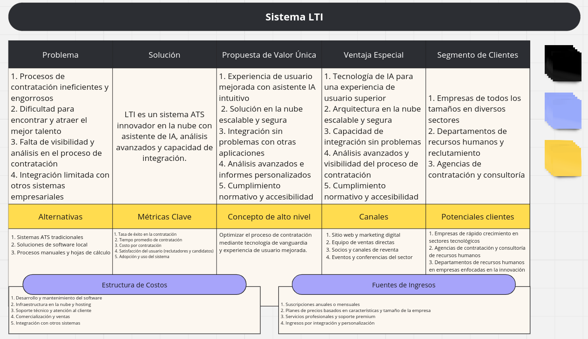
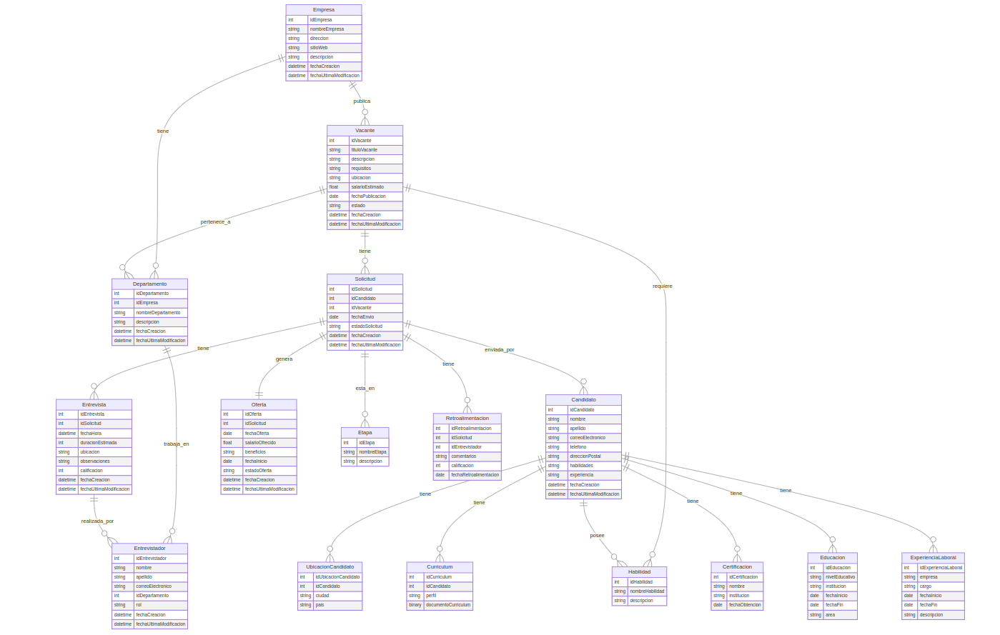
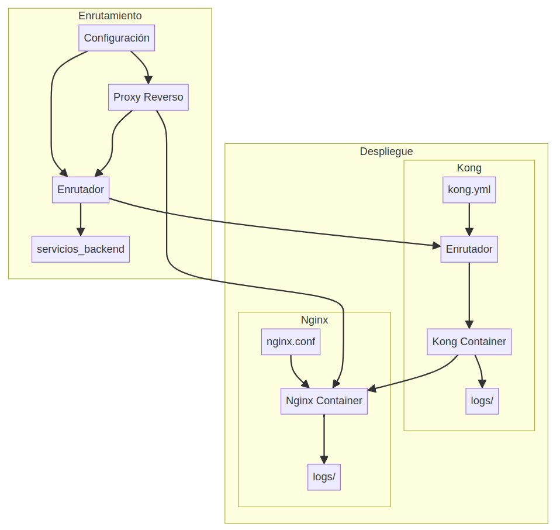

# Diseño de Sistema de Gestión de Candidatos
## _Sistema LTI (Leading Talent Insights)_

## Tabla de Contenido

1. [Introducción](#introducción)
2. [Descripción](#descripción)
    - [Ventajas](#ventajas)
3. [Modelo de negocio](#modelo-de-negocio)
    - [Lean Canvas](#lean-canvas)
4. [Diseño técnico](#diseño-técnico)
    - [Principales Casos de uso](#principales-casos-de-uso)
    - [Modelo de Datos](#modelo-de-datos)
    - [Diseño del Sistema LTI a alto nivel](#diseño-del-sistema-lti-a-alto-nivel)
    - [Diagrama C4 del Sistema LTI](#diagrama-c4-del-sistema-lti)
      - [Nivel 1: Contexto](#nivel-1-contexto)
      - [Nivel 2: Contenedores](#nivel-2-contenedores)
      - [Nivel 3: Componentes](#nivel-3-componentes)
      - [Nivel 4: Código](#nivel-4-código)
5. [Conclusión](#conclusión)

### Introducción
En un mercado laboral cada vez más competitivo, contratar y retener el mejor talento es crucial para el éxito de cualquier organización. Sin embargo, los procesos de reclutamiento tradicionales a menudo son engorrosos, ineficientes y carecen de una experiencia centrada en el usuario. LTI (Leading Talent Insights) aborda estos desafíos con un enfoque innovador y centrado en el candidato. Este sistema ATS (Applicant Tracking System) de vanguardia combina la potencia de la inteligencia artificial, la escalabilidad de la nube y la capacidad de integración para ofrecer una solución líder en el reclutamiento de talento.

### Descripción
LTI (Leading Talent Insights) es un innovador sistema ATS (Applicant Tracking System) diseñado para brindar una experiencia de contratación excepcional tanto para los reclutadores como para los candidatos. Este producto de vanguardia se destaca por su enfoque centrado en el usuario, su arquitectura en la nube y su capacidad de integración con otras aplicaciones, lo que lo convierte en una solución líder en el mercado.

### Ventajas
1. **Experiencia de usuario mejorada con asistencia de IA**:
   - LTI cuenta con un asistente virtual impulsado por Inteligencia Artificial que guía intuitivamente a los usuarios a través del proceso de contratación.
   - El asistente IA proporciona recomendaciones personalizadas, responde preguntas y facilita la navegación, brindando una experiencia fluida y sin fricciones.
   - Tanto los reclutadores como los candidatos pueden interactuar de manera natural con el asistente IA, ahorrando tiempo y esfuerzo.

2. **Solución en la nube escalable y segura**:
   - LTI se ofrece como un servicio en la nube, lo que significa que no hay necesidad de instalar ni mantener software en las instalaciones del cliente.
   - La arquitectura en la nube garantiza una escalabilidad sin problemas, permitiendo a las empresas adaptarse fácilmente a las fluctuaciones en la demanda.
   - Se implementan medidas de seguridad de última generación, como cifrado de datos, autenticación de dos factores y controles de acceso estrictos, para proteger la información confidencial de los candidatos y las empresas.

3. **Integración sin problemas con otras aplicaciones**:
   - LTI cuenta con una arquitectura de microservicios modular y una API robusta, lo que facilita la integración con otros sistemas empresariales, como sistemas de gestión de recursos humanos, plataformas de reclutamiento y herramientas de análisis de datos.
   - Esta capacidad de integración sin problemas permite a las empresas aprovechar al máximo su ecosistema de aplicaciones existente y optimizar los flujos de trabajo de contratación.

4. **Análisis avanzados e informes personalizados**:
   - LTI ofrece potentes capacidades de análisis e informes, brindando a los reclutadores y gerentes insights valiosos sobre el proceso de contratación.
   - Los informes personalizados y los paneles de control interactivos permiten a los usuarios monitorear métricas clave, como tiempos de contratación, fuentes de candidatos más efectivas y tasas de éxito.
   - Estos análisis profundos permiten tomar decisiones informadas y optimizar continuamente el proceso de contratación.

5. **Cumplimiento normativo y accesibilidad**:
   - LTI cumple con los más altos estándares de cumplimiento normativo, incluyendo regulaciones de privacidad de datos y accesibilidad para personas con discapacidad.
   - El sistema está diseñado para garantizar la igualdad de oportunidades y evitar sesgos en el proceso de contratación, promoviendo una cultura de diversidad e inclusión.

LTI se posiciona como una solución líder en el mercado de sistemas ATS, ofreciendo una combinación única de experiencia de usuario mejorada, arquitectura en la nube escalable, capacidad de integración, análisis avanzados y cumplimiento normativo. Con su enfoque innovador y sus características de vanguardia, LTI está listo para revolucionar el mundo del reclutamiento y la contratación de talento.

### Modelo de negocio
El siguiente diagrama Lean Canvas proporciona una visión general del modelo de negocio para el producto LTI, abordando los siguientes aspectos clave:
1. **Problemas**: Identifica los principales desafíos que enfrentan las empresas en el proceso de contratación.
2. **Segmento de Clientes**: Define los grupos objetivo a los que se dirige el producto.
3. **Propuesta de Valor Única**: Destaca las características y beneficios clave que diferencian a LTI de la competencia.
4. **Alternativas**: Enumera las soluciones existentes que los clientes podrían considerar en lugar de LTI.
5. **Métricas Clave**: Establece los indicadores clave de rendimiento para medir el éxito del producto.
6. **Estructura de Costos**: Identifica los principales componentes de costos asociados con el desarrollo y operación de LT.

## Diseño técnico
Se describe los principales aspectos de diseño del sistema en su versión básica.

### Principales Casos de uso.

A continuación se presentan los principales casos de uso en un diagrama UML. Se identifican los diferentes actores, distinguiendo entre usuarios visitantes y usuarios autenticados.

Este diagrama de casos de uso muestra los actores principales: "Candidato", "Reclutador" y "Administrador". Los casos de uso están agrupados dentro del rectángulo "Sistema ATS". Se utiliza las relaciones de extensión (`<<extend>>`) para representar los flujos alternativos y las dependencias entre ellos.

Algunas consideraciones adicionales:

- El actor "Candidato" es un usuario visitante que puede enviar solicitudes de empleo (UC3), pero no tiene acceso a otras funcionalidades del sistema.
- El actor "Reclutador" es un usuario autenticado que puede gestionar la mayor parte del proceso de contratación, desde la gestión de vacantes hasta la generación de ofertas de empleo y la revisión de informes.
- El actor "Administrador" es un usuario autenticado con privilegios adicionales para configurar y mantener el sistema, como la integración con otros sistemas (UC10).

Este diagrama proporciona una vista general de los casos de uso más importantes para el sistema LTI básico, resaltando las interacciones entre los diferentes actores y las funcionalidades clave del sistema. Puede ser utilizado como punto de partida para el análisis y diseño detallado del sistema, y puede ser ampliado o modificado según las necesidades específicas del proyecto.

### Modelo de Datos
En el siguiente diagrama se incluyen todas las principales entidades propuestas para el sistema LTI, junto con sus atributos y relaciones correspondientes.

Algunas consideraciones adicionales:

1. **Seguridad y autenticación**: Puede ser necesario agregar entidades relacionadas con usuarios, roles y permisos para gestionar el acceso y la autenticación en el sistema.

2. **Registros de auditoría**: Dependiendo de los requisitos de cumplimiento y auditoría, puede ser útil agregar una entidad para registrar los cambios y acciones realizadas en el sistema.

3. **Configuraciones y ajustes**: Puede ser necesario agregar entidades para almacenar configuraciones y ajustes del sistema, como plantillas de correo electrónico, preferencias de notificaciones, etc.

4. **Integración con otros sistemas**: Si el sistema ATS necesita integrarse con otros sistemas, como sistemas de recursos humanos, nómina o gestión de empleados, puede ser necesario agregar entidades o relaciones adicionales para facilitar la integración.

5. **Requisitos específicos del negocio**: Dependiendo de los requisitos específicos de la organización o industria, puede ser necesario agregar entidades adicionales para cubrir aspectos específicos del proceso de contratación.

Este diagrama entidad-relación representa una base sólida para el diseño de la base de datos del sistema LTI. Igualmente, puede evolucionar a medida que se refinan los requisitos y se identifican nuevas necesidades durante el desarrollo del sistema LTI.

### Diseño del Sistema LTI a alto nivel
El sistema LTI (Leading Talent Insights) está diseñado siguiendo una arquitectura de microservicios y una implementación en la nube. Esto permite una escalabilidad eficiente, una fácil integración con otros sistemas y una alta disponibilidad.

El sistema consta de los siguientes componentes principales:

1. **Frontend Web**: Es la interfaz de usuario principal donde los reclutadores y candidatos interactúan con el sistema. Está desarrollado utilizando tecnologías modernas como React o Angular, y se comunica con los servicios backend a través de APIs.

2. **Asistente de IA**: Es un componente clave que proporciona una experiencia de usuario mejorada mediante un asistente virtual impulsado por inteligencia artificial. Utiliza tecnologías de procesamiento de lenguaje natural y aprendizaje automático para comprender y responder a las consultas de los usuarios.

3. **Servicios Backend**: Son microservicios independientes que manejan diferentes funcionalidades del sistema, como la gestión de vacantes, el seguimiento de candidatos, la programación de entrevistas, etc. Estos servicios se comunican entre sí a través de un bus de mensajería y exponen APIs para interactuar con el frontend y otros sistemas.

4. **Base de Datos**: Es la capa de almacenamiento que utiliza una base de datos relacional o no relacional (dependiendo de los requisitos) para almacenar y gestionar los datos del sistema, como información de candidatos, vacantes, entrevistas, etc.

5. **Sistema de Análisis e Informes**: Es un componente que recopila y procesa datos del sistema para generar informes y análisis avanzados sobre el proceso de contratación. Puede utilizar tecnologías de big data y visualización de datos.

6. **Componente de Integración**: Es responsable de facilitar la integración con otros sistemas empresariales, como sistemas de recursos humanos, nómina, plataformas de reclutamiento, etc. Utiliza APIs y protocolos estándar para intercambiar datos de manera segura.

7. **Capa de Seguridad y Autenticación**: Es una capa transversal que garantiza la seguridad y la autenticación de los usuarios en todo el sistema. Puede incluir medidas como autenticación de dos factores, cifrado de datos, control de acceso basado en roles, etc.

8. **Capa de Monitoreo y Registro**: Es una capa transversal que monitorea el rendimiento y la salud del sistema, además de registrar eventos y errores para fines de depuración y auditoría.

A continuación el diagrama que representa el diseño del sistema LTI a alto nivel:

En este diagrama, se muestran los diferentes componentes del sistema LTI y cómo interactúan entre sí:

- El **Frontend Web** interactúa con el **API Gateway** para enviar solicitudes y recibir respuestas.
- El **Asistente de IA** también interactúa con el **API Gateway** para proporcionar asistencia basada en inteligencia artificial.
- El **API Gateway** enruta las solicitudes a los **Servicios Backend** correspondientes.
- Los **Servicios Backend** se comunican entre sí a través de un **Bus de Mensajería** y acceden a la **Base de Datos** para leer y escribir datos.
- El **Sistema de Análisis e Informes** consume datos de la **Base de Datos** para generar informes y análisis.
- El **Componente de Integración** facilita el intercambio de datos con **Sistemas Externos** a través del **API Gateway**.
- La **Capa de Seguridad y Autenticación** es una capa transversal que protege el acceso y las operaciones en todo el sistema.
- La **Capa de Monitoreo y Registro** también es una capa transversal que monitorea el rendimiento y registra eventos en todo el sistema.

Este diseño de alto nivel sigue los principios de la arquitectura de microservicios, lo que permite una mayor escalabilidad, flexibilidad y facilidad de mantenimiento. Además, la implementación en la nube brinda beneficios como alta disponibilidad, escalabilidad elástica y reducción de costos operativos.

Es importante tener en cuenta que este diagrama representa una visión general del diseño del sistema LTI y que cada componente puede tener su propia arquitectura interna y detalles de implementación más específicos.

### Diagrama C4 del Sistema LTI

En los siguientes diagramas, se muestran los cuatro niveles del Diagrama C4, detallando el componente "API Gateway" del sistema LTI:

1. **Nivel 1: Contexto**: Muestra el sistema LTI y sus componentes principales, así como las interacciones con los actores (Reclutador y Candidato).

2. **Nivel 2: Contenedores**: Profundiza en el componente "API Gateway" y muestra sus subcomponentes internos, como el Enrutamiento, la Autenticación, el Balanceo de Carga, la Caché, el Monitoreo y el Registro.

3. **Nivel 3: Componentes**: Se enfoca en el subcomponente "Enrutamiento" del "API Gateway" y muestra sus componentes internos, como la Configuración, el Proxy Reverso y el Enrutador.

4. **Nivel 4: Código**: Representa el despliegue del subcomponente "Enrutamiento" y muestra los contenedores Docker utilizados para el Proxy Reverso (Nginx) y el Enrutador (Kong), así como los archivos de configuración y logs asociados.

Estos diagramas brindan una visión detallada de la arquitectura del componente "API Gateway", desde el contexto general del sistema hasta los detalles de implementación y despliegue. Esto facilita la comprensión de cómo se estructura y se implementa este componente clave del sistema LTI.

### Conclusión

LTI representa un avance significativo en la gestión de candidatos, simplificando y optimizando el proceso de contratación. Con su arquitectura de microservicios, implementación en la nube, asistente virtual de IA, análisis avanzados e integración transparente, LTI brinda una experiencia excepcional tanto para reclutadores como candidatos. Al adoptar esta solución, las organizaciones pueden esperar una mayor eficiencia, una ventaja competitiva en la adquisición de talento y, en última instancia, un impacto positivo en su desempeño general. El diseño técnico detallado en este documento sienta las bases para una implementación exitosa de LTI, guiando a los equipos de ingeniería y partes interesadas a través de sus capacidades y componentes clave. En un mundo donde el talento es el activo más valioso, LTI emerge como una herramienta poderosa para ayudar a las empresas a prosperar.

