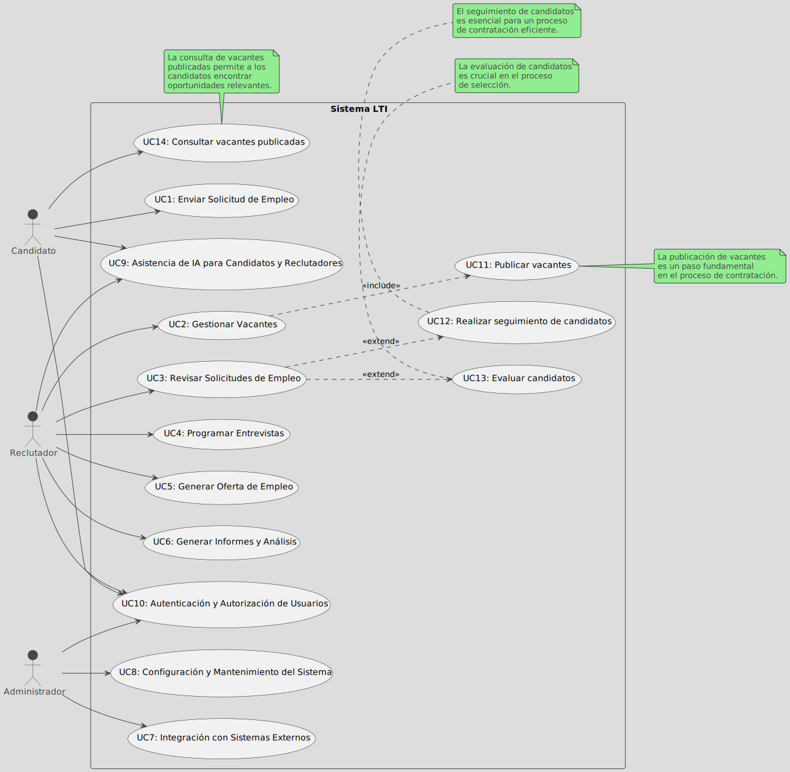
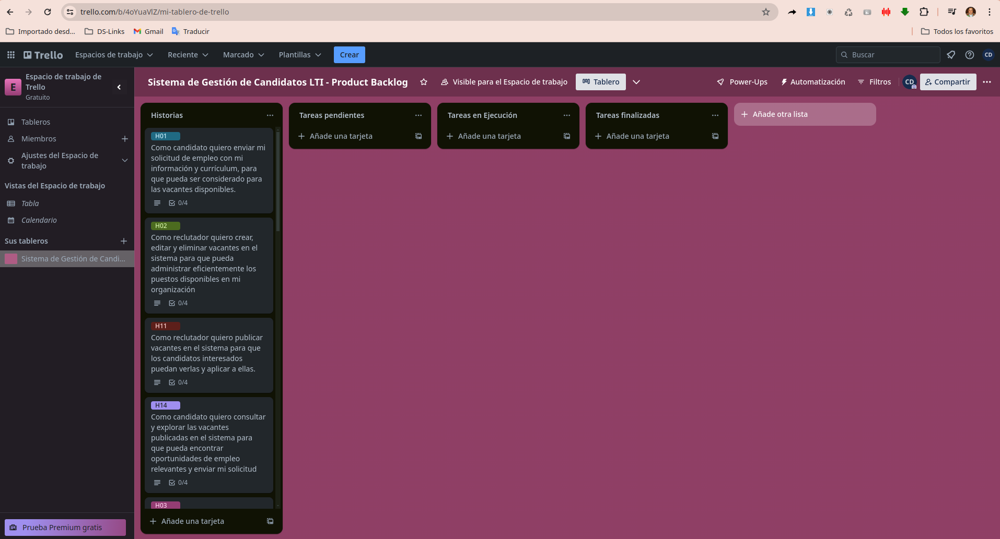

# Backlog del Sistema de Gestión de Candidatos LTI
## Asistente: Claude Sonnet

## Tabla de contenido
1. [Revisión inicial](#revisión-inicial) 
2. [Historias de Usuario](#historias-de-usuario)
    - [Historia de Usuario 1](#historia-de-usuario-1)
    - [Historia de Usuario 2](#historia-de-usuario-2)
    - [Historia de Usuario 3](#historia-de-usuario-3)
    - [Historia de Usuario 4](#historia-de-usuario-4)
    - [Historia de Usuario 5](#historia-de-usuario-5)
    - [Historia de Usuario 6](#historia-de-usuario-6)
    - [Historia de Usuario 7](#historia-de-usuario-7)
    - [Historia de Usuario 8](#historia-de-usuario-8)
    - [Historia de Usuario 9](#historia-de-usuario-9)
    - [Historia de Usuario 10](#historia-de-usuario-10)
    - [Historia de Usuario 11](#historia-de-usuario-11)
    - [Historia de Usuario 12](#historia-de-usuario-12)
    - [Historia de Usuario 13](#historia-de-usuario-13)
    - [Historia de Usuario 14](#historia-de-usuario-14)
3. [Requisitos técnicos](#requisitos-técnicos)
4. [Consideraciones no funcionales](#consideraciones-no-funcionales)
5. [Matriz de priorización de historias de usuario](#matriz-de-priorización-de-historias-de-usuario)
6. [Backlog del producto en Trello](#backlog-del-producto-en-trello)
7. [Creación de tickets de trabajo de las historias](#creación-de-tickets-de-trabajo-de-las-historias)

## Revisión inicial
Se realiza revisión de los casos de uso básicos, se  identifican otros que se consideran importantes para la primera versión del producto: Publicar vacantes, Realizar seguimiento de candidatos, Evaluar candidatos, y Consultar vacantes publicadas. Se modifica el documento de requisitos del producto para incluir los nuevos casos de uso. La inclusión de estos casos de uso ayudará a garantizar que el sistema LTI cumpla con los requisitos y necesidades de los usuarios.

Este diagrama proporciona una representación visual clara de los casos de uso y sus relaciones dentro del sistema LTI, lo que facilita la comprensión y el diseño del sistema.

## Historias de Usuario
A continuación se describen las historias de usuario generadas a partir de los casos de uso del sistema.

Claro, con mucho gusto generaré las historias de usuario para los 14 casos de uso del sistema LTI, siguiendo la plantilla proporcionada y aplicando los principios de escritura clara y concisa definidos por William Zinsser.

### Historia de Usuario 1:

1. **Título de la Historia de Usuario**: Enviar Solicitud de Empleo como Candidato.

2. **Como** candidato,

3. **quiero** enviar mi solicitud de empleo con mi información y currículum,

4. **para que** pueda ser considerado para las vacantes disponibles.

**Criterios de Aceptación**:

1. El candidato debe poder acceder a un formulario en línea para ingresar su información personal y currículum.
2. El sistema debe validar que todos los campos obligatorios estén completados correctamente.
3. El sistema debe permitir al candidato adjuntar archivos relacionados con su currículum y documentos de respaldo.
4. Una vez enviada la solicitud, el sistema debe enviar una confirmación al candidato.

**Notas Adicionales**:

- El formulario de solicitud debe ser fácil de usar y accesible desde diferentes dispositivos.
- Se debe proporcionar instrucciones claras sobre cómo completar y enviar la solicitud.

**Prioridad**: Alta.

### Historia de Usuario 2:

1. **Título de la Historia de Usuario**: Gestionar Vacantes como Reclutador.

2. **Como** reclutador,

3. **quiero** crear, editar y eliminar vacantes en el sistema,

4. **para que** pueda administrar eficientemente los puestos disponibles en mi organización.

**Criterios de Aceptación**:

1. El reclutador debe poder crear una nueva vacante ingresando detalles como título, descripción, requisitos, ubicación, etc.
2. El reclutador debe poder editar los detalles de una vacante existente.
3. El reclutador debe poder eliminar una vacante existente.
4. El sistema debe mostrar una lista de todas las vacantes activas y cerradas.

**Notas Adicionales**:

- Se debe proporcionar una interfaz intuitiva para la gestión de vacantes.
- El sistema debe permitir la personalización de los campos de vacante según los requisitos de la organización.

**Prioridad**: Alta.

### Historia de Usuario 3:

1. **Título de la Historia de Usuario**: Revisar Solicitudes de Empleo como Reclutador.

2. **Como** reclutador,

3. **quiero** revisar las solicitudes de empleo enviadas por los candidatos,

4. **para que** pueda evaluar y seleccionar a los candidatos más adecuados para las vacantes disponibles.

**Criterios de Aceptación**:

1. El reclutador debe poder ver una lista de todas las solicitudes de empleo recibidas.
2. El reclutador debe poder filtrar y ordenar las solicitudes según criterios específicos (p. ej., vacante, ubicación, experiencia).
3. El reclutador debe poder ver los detalles completos de una solicitud, incluyendo el currículum y los documentos adjuntos.
4. El reclutador debe poder marcar una solicitud como "revisada" o "descartada".

**Notas Adicionales**:

- La interfaz de revisión de solicitudes debe ser fácil de usar y permitir una evaluación eficiente de los candidatos.
- Se debe proporcionar opciones de búsqueda y filtrado avanzadas para facilitar la revisión de un gran número de solicitudes.

**Historias de Usuario Relacionadas**:

- Historia de Usuario 1: Enviar Solicitud de Empleo como Candidato.
- Historia de Usuario 2: Gestionar Vacantes como Reclutador.

**Prioridad**: Alta.

### Historia de Usuario 4:

1. **Título de la Historia de Usuario**: Programar Entrevistas como Reclutador.

2. **Como** reclutador,

3. **quiero** programar entrevistas con los candidatos seleccionados,

4. **para que** pueda evaluar su idoneidad de manera más profunda.

**Criterios de Aceptación**:

1. El reclutador debe poder seleccionar a los candidatos para programar entrevistas.
2. El sistema debe permitir al reclutador ingresar detalles de la entrevista, como fecha, hora, lugar y entrevistadores.
3. El sistema debe enviar notificaciones automáticas a los candidatos y entrevistadores con la información de la entrevista.
4. El reclutador debe poder ver un calendario con todas las entrevistas programadas.

**Notas Adicionales**:

- El proceso de programación de entrevistas debe ser ágil y eficiente.
- Se debe proporcionar opciones para gestionar conflictos de horarios y reprogramar entrevistas.

**Historias de Usuario Relacionadas**:

- Historia de Usuario 3: Revisar Solicitudes de Empleo como Reclutador.

**Prioridad**: Alta.

### Historia de Usuario 5:

1. **Título de la Historia de Usuario**: Generar Oferta de Empleo como Reclutador.

2. **Como** reclutador,

3. **quiero** generar y enviar una oferta de empleo a un candidato seleccionado,

4. **para que** pueda formalizar su incorporación a la organización.

**Criterios de Aceptación**:

1. El reclutador debe poder seleccionar a un candidato para generar una oferta de empleo.
2. El sistema debe permitir al reclutador ingresar los detalles de la oferta, como la posición, el salario, los beneficios y las condiciones laborales.
3. El sistema debe generar un documento de oferta de empleo en un formato estandarizado.
4. El sistema debe enviar automáticamente la oferta de empleo al candidato seleccionado.

**Notas Adicionales**:

- El proceso de generación de ofertas de empleo debe ser rápido y eficiente.
- Se debe proporcionar plantillas personalizables para las ofertas de empleo.

**Historias de Usuario Relacionadas**:

- Historia de Usuario 3: Revisar Solicitudes de Empleo como Reclutador.
- Historia de Usuario 4: Programar Entrevistas como Reclutador.

**Prioridad**: Alta.

### Historia de Usuario 6:

1. **Título de la Historia de Usuario**: Generar Informes y Análisis como Reclutador.

2. **Como** reclutador,

3. **quiero** generar informes y análisis sobre el proceso de contratación,

4. **para que** pueda monitorear el rendimiento y tomar decisiones informadas.

**Criterios de Aceptación**:

1. El reclutador debe poder seleccionar el tipo de informe o análisis que desea generar, como métricas de contratación, fuentes de candidatos, tasas de éxito, etc.
2. El sistema debe permitir al reclutador configurar filtros y rangos de fechas para los informes.
3. El sistema debe generar informes y visualizaciones de datos claros y fáciles de interpretar.
4. El reclutador debe poder exportar los informes en diferentes formatos (PDF, Excel, etc.).

**Notas Adicionales**:

- Los informes y análisis deben ser personalizables y adaptables a las necesidades específicas de la organización.
- Se debe proporcionar capacidades de análisis avanzadas, como tendencias históricas y proyecciones futuras.

**Prioridad**: Media.

### Historia de Usuario 7:

1. **Título de la Historia de Usuario**: Integración con Sistemas Externos como Administrador.

2. **Como** administrador,

3. **quiero** integrar el sistema LTI con otros sistemas empresariales,

4. **para que** se facilite el intercambio de datos y la optimización de los flujos de trabajo

**Criterios de Aceptación**:

1. El sistema debe proporcionar una API robusta y documentada para facilitar la integración con otros sistemas.
2. El administrador debe poder configurar y gestionar las conexiones con sistemas externos, como sistemas de recursos humanos, nómina, plataformas de reclutamiento, etc.
3. El sistema debe implementar mecanismos de seguridad y autenticación para garantizar la integridad y confidencialidad de los datos durante la integración.
4. El sistema debe permitir la sincronización bidireccional de datos entre LTI y los sistemas externos.

**Notas Adicionales**:

- La integración con sistemas externos debe ser escalable y adaptable a los cambios en los sistemas involucrados.
- Se debe proporcionar soporte técnico y documentación detallada para facilitar la integración.

**Prioridad**: Media.

### Historia de Usuario 8:

1. **Título de la Historia de Usuario**: Configuración y Mantenimiento del Sistema como Administrador.

2. **Como** administrador,

3. **quiero** configurar y mantener el sistema LTI,

4. **para que** se garantice su correcto funcionamiento y seguridad.

**Criterios de Aceptación**:

1. El administrador debe poder gestionar usuarios, roles y permisos dentro del sistema.
2. El sistema debe permitir la configuración de ajustes generales, como preferencias, plantillas y opciones de personalización.
3. El administrador debe poder realizar tareas de mantenimiento, como copias de seguridad, actualizaciones y monitoreo de rendimiento.
4. El sistema debe proporcionar una interfaz administrativa clara y fácil de usar.

**Notas Adicionales**:

- La configuración y el mantenimiento del sistema deben ser procesos sencillos y bien documentados.
- Se debe implementar medidas de seguridad adecuadas para proteger la integridad del sistema y los datos.

**Prioridad**: Media.

### Historia de Usuario 9:

1. **Título de la Historia de Usuario**: Asistencia de IA para Candidatos y Reclutadores.

2. **Como** candidato o reclutador,

3. **quiero** interactuar con un asistente virtual impulsado por Inteligencia Artificial,

4. **para que** me guíe a través del proceso de contratación y me brinde recomendaciones personalizadas.

**Criterios de Aceptación**:

1. El asistente de IA debe ser capaz de comprender y responder preguntas en lenguaje natural.
2. El asistente debe proporcionar instrucciones y recomendaciones claras y relevantes para los usuarios.
3. El asistente debe adaptarse a las necesidades y preferencias individuales de los usuarios.
4. El asistente debe estar disponible en múltiples canales (web, móvil, chat, voz, etc.).

**Notas Adicionales**:

- La asistencia de IA debe ser intuitiva y fácil de usar para todos los usuarios, independientemente de su nivel de experiencia tecnológica.
- El asistente de IA debe ser continuamente mejorado y actualizado para brindar una mejor experiencia.

**Prioridad**: Media.

### Historia de Usuario 10:

1. **Título de la Historia de Usuario**: Autenticación y Autorización de Usuarios.

2. **Como** usuario del sistema (candidato, reclutador, administrador),

3. **quiero** autenticarme y tener acceso a las funcionalidades correspondientes a mi rol,

4. **para que** se proteja la información confidencial y se garantice la seguridad del sistema.

**Criterios de Aceptación**:

1. El sistema debe implementar un proceso de autenticación seguro, como autenticación de dos factores o integración con proveedores de identidad confiables.
2. El sistema debe aplicar un control de acceso basado en roles, otorgando permisos y restricciones según el tipo de usuario.
3. El sistema debe registrar y auditar todos los intentos de acceso y actividades realizadas por los usuarios.
4. El sistema debe proporcionar mecanismos para restablecer y cambiar credenciales de acceso de manera segura.

**Notas Adicionales**:

- La seguridad y privacidad de los datos de los usuarios deben ser una prioridad en todo momento.
- Se deben implementar medidas de seguridad adicionales, como cifrado de datos, protección contra ataques y cumplimiento de normativas relevantes.

**Prioridad**: Alta.

### Historia de Usuario 11:

1. **Título de la Historia de Usuario**: Publicar Vacantes como Reclutador.

2. **Como** reclutador,

3. **quiero** publicar vacantes en el sistema,

4. **para que** los candidatos interesados puedan verlas y aplicar a ellas.

**Criterios de Aceptación**:

1. El reclutador debe poder seleccionar una vacante existente para publicarla.
2. El sistema debe permitir al reclutador configurar los detalles de la publicación, como la fecha de inicio y finalización, la visibilidad, etc.
3. Una vez publicada, la vacante debe ser visible para los candidatos que buscan oportunidades laborales.
4. El sistema debe proporcionar una vista clara de todas las vacantes publicadas y sus detalles.

**Notas Adicionales**:

- La publicación de vacantes debe ser un proceso sencillo y rápido.
- Se debe proporcionar opciones para promocionar y destacar vacantes específicas.

**Historias de Usuario Relacionadas**:

- Historia de Usuario 2: Gestionar Vacantes como Reclutador.

**Prioridad**: Alta.

### Historia de Usuario 12:

1. **Título de la Historia de Usuario**: Realizar Seguimiento de Candidatos como Reclutador.

2. **Como** reclutador,

3. **quiero** realizar un seguimiento del estado y progreso de los candidatos en el proceso de contratación,

4. **para que** pueda gestionar eficientemente el flujo de candidatos y no perder oportunidades de contratación.

**Criterios de Aceptación**:

1. El reclutador debe poder ver una lista de todos los candidatos en el proceso de contratación, con su estado actual (por ejemplo, "solicitado", "entrevistado", "oferta enviada", etc.).
2. El sistema debe permitir al reclutador cambiar el estado de un candidato y agregar notas o comentarios relevantes.
3. El sistema debe proporcionar una línea de tiempo visual del progreso de cada candidato a través del proceso de contratación.
4. El reclutador debe poder configurar recordatorios y alertas para acciones pendientes relacionadas con los candidatos.

**Notas Adicionales**:

- El seguimiento de candidatos debe ser intuitivo y fácil de usar, permitiendo una gestión eficiente de un gran número de candidatos.
- Se debe proporcionar opciones de filtrado y ordenamiento para facilitar la visualización de los candidatos según diferentes criterios.

**Historias de Usuario Relacionadas**:

- Historia de Usuario 3: Revisar Solicitudes de Empleo como Reclutador.
- Historia de Usuario 4: Programar Entrevistas como Reclutador.
- Historia de Usuario 5: Generar Oferta de Empleo como Reclutador.

**Prioridad**: Alta.

### Historia de Usuario 13:

1. **Título de la Historia de Usuario**: Evaluar Candidatos como Reclutador.

2. **Como** reclutador,

3. **quiero** evaluar y calificar a los candidatos en función de criterios predefinidos,

4. **para que** pueda seleccionar a los candidatos más idóneos para las vacantes disponibles.

**Criterios de Aceptación**:

1. El reclutador debe poder definir los criterios de evaluación relevantes para cada vacante, como habilidades, experiencia, formación académica, etc.
2. El sistema debe permitir al reclutador asignar calificaciones o puntajes a cada candidato en función de los criterios definidos.
3. El sistema debe proporcionar una vista consolidada de las calificaciones y rankings de los candidatos para facilitar la comparación.
4. El reclutador debe poder agregar comentarios y notas sobre la evaluación de cada candidato.

**Notas Adicionales**:

- Los criterios de evaluación deben ser flexibles y personalizables según las necesidades de cada vacante y organización.
- Se debe implementar medidas para evitar sesgos y garantizar la igualdad de oportunidades en el proceso de evaluación.

**Historias de Usuario Relacionadas**:

- Historia de Usuario 3: Revisar Solicitudes de Empleo como Reclutador.
- Historia de Usuario 12: Realizar Seguimiento de Candidatos como Reclutador.

**Prioridad**: Alta.

### Historia de Usuario 14:

1. **Título de la Historia de Usuario**: Consultar Vacantes Publicadas como Candidato.

2. **Como** candidato,

3. **quiero** consultar y explorar las vacantes publicadas en el sistema,

4. **para que** pueda encontrar oportunidades de empleo relevantes y enviar mi solicitud.

**Criterios de Aceptación**:

1. El candidato debe poder ver una lista de todas las vacantes publicadas en el sistema.
2. El sistema debe permitir al candidato filtrar y ordenar las vacantes según criterios específicos, como ubicación, industria, nivel de experiencia, etc.
3. El candidato debe poder ver los detalles completos de una vacante, incluyendo la descripción, los requisitos y las instrucciones para aplicar.
4. El sistema debe proporcionar un enlace o formulario para que el candidato pueda enviar su solicitud de empleo directamente desde la vacante publicada.

**Notas Adicionales**:

- La interfaz de consulta de vacantes debe ser intuitiva y fácil de usar para los candidatos.
- Se debe implementar medidas para garantizar la accesibilidad y la usabilidad del sistema para todos los usuarios.

**Historias de Usuario Relacionadas**:

- Historia de Usuario 1: Enviar Solicitud de Empleo como Candidato.
- Historia de Usuario 11: Publicar Vacantes como Reclutador.

**Prioridad**: Alta.

## Requisitos técnicos
Para la creación del Sistema de Gestión de Candidatos LTI se deben cumplir los siguientes aspectos técnicos.

1. **Interfaz de usuario web**:
   - Desarrollo de una interfaz de usuario web responsiva y accesible para candidatos y reclutadores.
   - Implementación de formularios y funcionalidades para enviar solicitudes de empleo, gestionar vacantes, revisar candidatos, programar entrevistas, generar ofertas, etc.
   - Integración de capacidades de búsqueda, filtrado y ordenamiento de vacantes y candidatos.
   - Implementación de vistas y paneles para visualizar información relevante, como listas de vacantes, detalles de candidatos, calendarios de entrevistas, etc.

2. **Asistente de Inteligencia Artificial**:
   - Integración de tecnologías de procesamiento de lenguaje natural (PLN) y aprendizaje automático para crear un asistente virtual inteligente.
   - Desarrollo de modelos de comprensión de lenguaje natural para interpretar consultas de usuarios.
   - Implementación de algoritmos de generación de respuestas y recomendaciones personalizadas.
   - Integración del asistente de IA con la interfaz de usuario web y otros componentes del sistema.

3. **Backend y API**:
   - Desarrollo de una arquitectura de microservicios para manejar diferentes funcionalidades del sistema (gestión de vacantes, seguimiento de candidatos, generación de ofertas, etc.).
   - Implementación de APIs RESTful o GraphQL para la comunicación entre el frontend y los servicios backend.
   - Integración de un sistema de gestión de bases de datos (relacionales o no relacionales) para almacenar y recuperar datos del sistema.
   - Implementación de mecanismos de autenticación y autorización para garantizar la seguridad del sistema.

4. **Integración con sistemas externos**:
   - Desarrollo de componentes de integración para facilitar la comunicación con sistemas externos, como sistemas de recursos humanos, nómina, plataformas de reclutamiento, etc.
   - Implementación de protocolos y estándares de integración (como APIs, webhooks, servicios web, etc.).
   - Desarrollo de mecanismos de sincronización y mapping de datos entre el sistema LTI y los sistemas externos.

5. **Análisis e informes**:
   - Implementación de capacidades de recopilación, procesamiento y análisis de datos del sistema.
   - Desarrollo de informes y visualizaciones de datos personalizables para monitorear métricas clave del proceso de contratación.
   - Integración de tecnologías de inteligencia de negocios (BI) y análisis de datos para generar insights avanzados.

6. **Infraestructura y despliegue**:
   - Diseño e implementación de una arquitectura en la nube escalable y segura para el sistema LTI.
   - Configuración de entornos de desarrollo, pruebas y producción.
   - Implementación de mecanismos de monitoreo, registro y alertas para garantizar el rendimiento y la disponibilidad del sistema.
   - Automatización de procesos de compilación, pruebas e implementación mediante técnicas de integración y entrega continuas (CI/CD).

7. **Seguridad y cumplimiento**:
   - Implementación de medidas de seguridad, como cifrado de datos, autenticación de dos factores, protección contra ataques, etc.
   - Cumplimiento de normativas y regulaciones relevantes, como protección de datos, accesibilidad y no discriminación.
   - Implementación de controles de acceso basados en roles y permisos.
   - Auditoría y registro de actividades del sistema para fines de cumplimiento y trazabilidad.

Estos son los principales requisitos técnicos clave que se identifican a partir de las historias de usuario propuestas. Es importante tener en cuenta que estos requisitos pueden evolucionar y refinarse a medida que se avance en el desarrollo del sistema LTI y se obtenga más información sobre los requisitos específicos del negocio y las restricciones técnicas.

## Consideraciones no funcionales 
Se identifican los principales consideraciones no funcionales que deben ser tomadas en cuenta para garantizar la satisfacción de los usuarios.

1. **Problema**: La interfaz de usuario puede resultar confusa o poco intuitiva para algunos usuarios, lo que dificultaría la navegación y el uso eficiente del sistema.

**Sugerencia de mejora**: Implementar un diseño centrado en el usuario, con pruebas de usabilidad y accesibilidad para garantizar una experiencia fluida y amigable. Además, se podría incluir tutoriales interactivos o asistencia en línea para ayudar a los usuarios a familiarizarse con el sistema.

2. **Problema**: El proceso de búsqueda y filtrado de vacantes o candidatos puede ser lento o poco efectivo, lo que dificultaría encontrar oportunidades o perfiles relevantes.

**Sugerencia de mejora**: Mejorar las capacidades de búsqueda y filtrado mediante la implementación de algoritmos de búsqueda avanzados, indexación de datos y optimización del rendimiento. Además, se podría incorporar funcionalidades de búsqueda semántica o basada en inteligencia artificial para obtener resultados más precisos.

3. **Problema**: La carga y procesamiento de grandes volúmenes de datos (como currículums o información de candidatos) puede ser lenta o generar errores, lo que afectaría la eficiencia del sistema.

**Sugerencia de mejora**: Optimizar el manejo de archivos y datos mediante técnicas de procesamiento paralelo, compresión de datos y almacenamiento escalable en la nube. Además, se podría implementar mecanismos de validación y procesamiento de datos más robustos para evitar errores.

4. **Problema**: La falta de integración con otros sistemas empresariales, como sistemas de recursos humanos o plataformas de reclutamiento, puede generar duplicación de esfuerzos y errores en la transferencia de datos.

**Sugerencia de mejora**: Ampliar las capacidades de integración del sistema LTI mediante el desarrollo de APIs y protocolos de comunicación estándar. Además, se podría implementar herramientas de mapeo y sincronización de datos para facilitar la integración con diferentes sistemas.

5. **Problema**: La falta de capacidades de análisis y generación de informes personalizados puede dificultar la toma de decisiones informadas y la optimización del proceso de contratación.

**Sugerencia de mejora**: Incorporar herramientas de inteligencia de negocios y análisis de datos avanzados, que permitan a los usuarios obtener insights valiosos y generar informes personalizados según sus necesidades específicas. Además, se podría implementar funcionalidades de visualización de datos interactivas para facilitar la interpretación de los resultados.

Estas sugerencias de mejora buscan abordar los posibles problemas identificados y mejorar la experiencia de usuario, la eficiencia, la integración y las capacidades analíticas del sistema LTI. Es importante tener en cuenta que estas mejoras deben ser priorizadas y planificadas cuidadosamente, considerando los requisitos específicos del negocio, los recursos disponibles y las limitaciones técnicas.

## Matriz de priorización de historias de usuario

A continuación, se presenta una tabla con los criterios para la estimación y priorización de las historias de usuario definidas anteriormente para el sistema de gestión de candidatos LTI.   
Se toman en cuenta los siguientes aspectos:
1. Impacto en el usuario y valor del negocio.
2. Urgencia basada en tendencias del mercado y feedback de usuarios.
3. Complejidad y esfuerzo estimado de implementación.
4. Riesgos y dependencias entre tareas.

| Historia de Usuario | Impacto en el Usuario y Valor del Negocio | Urgencia | Complejidad y Esfuerzo Estimado | Riesgos y Dependencias |
| --- | --- | --- | --- | --- |
| 1. Enviar Solicitud de Empleo como Candidato | **Alto impacto en el usuario:** facilita el proceso de aplicación a oportunidades laborales. **Alto valor para el negocio:** atrae a más candidatos calificados. | **Alta urgencia:** los candidatos esperan un proceso de aplicación simple y eficiente. | *Complejidad media:* integración con sistemas de currículum y documentos. *Esfuerzo medio*. | **Riesgos:** Problemas de usabilidad en el formulario de solicitud. **Dependencias:** Infraestructura de hosting y base de datos. |
| 2. Gestionar Vacantes como Reclutador | **Alto impacto en el usuario:** permite a los reclutadores administrar eficientemente las vacantes. **Alto valor para el negocio:** facilita el proceso de contratación. | **Alta urgencia:** los reclutadores necesitan poder publicar y gestionar vacantes de manera ágil. | *Complejidad media:* diseño de formularios y flujos de trabajo. *Esfuerzo medio*. | **Riesgos:** Problemas de rendimiento al gestionar grandes volúmenes de vacantes. **Dependencias:** Integración con sistemas de recursos humanos. |
| 3. Revisar Solicitudes de Empleo como Reclutador | **Alto impacto en el usuario:** facilita la revisión y evaluación de candidatos. **Alto valor para el negocio:** mejora la eficiencia del proceso de contratación. | **Alta urgencia:** los reclutadores necesitan herramientas potentes para revisar solicitudes. | *Complejidad media:* diseño de interfaces de revisión y filtrado. **Esfuerzo medio-alto**. | **Riesgos:** Problemas de rendimiento al manejar grandes volúmenes de solicitudes. **Dependencias:** Historia de Usuario 1. |
| 4. Programar Entrevistas como Reclutador | **Alto impacto en el usuario:** facilita la coordinación de entrevistas. **Alto valor para el negocio:** mejora la eficiencia del proceso de contratación. | **Alta urgencia:** los reclutadores necesitan programar entrevistas de manera ágil. | *Complejidad media:* diseño de interfaces de programación y notificaciones. *Esfuerzo medio*. | **Riesgos:** Problemas de integración con calendarios y sistemas de correo. **Dependencias:** Historia de Usuario 3. |
| 5. Generar Oferta de Empleo como Reclutador | **Alto impacto en el usuario:** facilita la generación y envío de ofertas. **Alto valor para el negocio:** mejora la eficiencia del proceso de contratación. | **Alta urgencia:** los reclutadores necesitan generar ofertas rápidamente. | *Complejidad media:* diseño de plantillas y generación de documentos. *Esfuerzo medio*. | **Riesgos:** Problemas de integración con sistemas de recursos humanos. **Dependencias:** Historia de Usuario 3, Historia de Usuario 4. |
| 6. Generar Informes y Análisis como Reclutador | *Impacto medio en el usuario:* proporciona insights valiosos. **Alto valor para el negocio:** permite optimizar el proceso de contratación. | *Urgencia media:* los informes son importantes pero no críticos. | **Complejidad alta:** integración con herramientas de análisis de datos y visualización. **Esfuerzo alto**. | **Riesgos:** Problemas de rendimiento y escalabilidad al manejar grandes volúmenes de datos. **Dependencias:** Historias de Usuario 1, 2, 3, 4 y 5. |
| 7. Integración con Sistemas Externos como Administrador | Impacto bajo en el usuario: transparente para la mayoría de usuarios. **Alto valor para el negocio:** facilita la integración con otros sistemas. | Urgencia media-alta: la integración es importante pero no crítica al inicio. | **Complejidad alta:** diseño de APIs y mecanismos de integración. **Esfuerzo alto**. | **Riesgos:** Problemas de seguridad y privacidad de datos. **Dependencias:** Historias de Usuario 1, 2, 3, 4 y 5. |
| 8. Configuración y Mantenimiento del Sistema como Administrador | Impacto bajo en el usuario: transparente para la mayoría de usuarios. **Alto valor para el negocio:** garantiza el correcto funcionamiento del sistema. | *Urgencia media:* importante pero no crítica al inicio. | *Complejidad media:* diseño de interfaces administrativas y herramientas de configuración. *Esfuerzo medio*. | **Riesgos:** Problemas de seguridad y acceso no autorizado. **Dependencias:** Todas las historias de usuario. |
| 9. Asistencia de IA para Candidatos y Reclutadores | **Alto impacto en el usuario:** mejora la experiencia de usuario con asistencia inteligente. **Alto valor para el negocio:** diferenciador competitivo. | *Urgencia media:* no es crítica al inicio pero aporta gran valor a largo plazo. | **Complejidad alta:** integración de tecnologías de procesamiento de lenguaje natural y aprendizaje automático. **Esfuerzo alto**. | **Riesgos:** Problemas de precisión y relevancia de las respuestas del asistente. **Dependencias:** Todas las historias de usuario relacionadas con candidatos y reclutadores. |
| 10. Autenticación y Autorización de Usuarios | Impacto bajo en el usuario: transparente pero crítico. **Alto valor para el negocio:** garantiza la seguridad y privacidad de datos. | **Alta urgencia:** es un requerimiento fundamental desde el inicio. | *Complejidad media:* implementación de mecanismos de autenticación y control de acceso. *Esfuerzo medio*. | **Riesgos:** Problemas de seguridad y vulnerabilidades. **Dependencias:** Todas las historias de usuario. |
| 11. Publicar Vacantes como Reclutador | **Alto impacto en el usuario:** facilita la publicación de vacantes. **Alto valor para el negocio:** atrae a más candidatos calificados. | **Alta urgencia:** los reclutadores necesitan publicar vacantes desde el inicio. | *Complejidad media:* diseño de interfaces de publicación y visibilidad. *Esfuerzo medio*. | **Riesgos:** Problemas de rendimiento al manejar grandes volúmenes de vacantes publicadas. **Dependencias:** Historia de Usuario 2. |
| 12. Realizar Seguimiento de Candidatos como Reclutador | **Alto impacto en el usuario:** facilita el seguimiento del proceso de contratación. **Alto valor para el negocio:** mejora la eficiencia del proceso de contratación. | **Alta urgencia:** los reclutadores necesitan realizar seguimiento desde el inicio. | Complejidad media-alta: diseño de interfaces de seguimiento y líneas de tiempo. **Esfuerzo medio-alto**. | **Riesgos:** Problemas de rendimiento al manejar grandes volúmenes de candidatos. **Dependencias:** Historias de Usuario 3, 4 y 5. |
| 13. Evaluar Candidatos como Reclutador | **Alto impacto en el usuario:** facilita la evaluación de candidatos. **Alto valor para el negocio:** mejora la calidad de las contrataciones. | **Alta urgencia:** los reclutadores necesitan evaluar candidatos desde el inicio. | *Complejidad media:* diseño de criterios de evaluación y calificación. *Esfuerzo medio*. | **Riesgos:** Problemas de sesgos y discriminación en la evaluación. **Dependencias:** Historia de Usuario 3. |
| 14. Consultar Vacantes Publicadas como Candidato | **Alto impacto en el usuario:** facilita la búsqueda de oportunidades laborales. **Alto valor para el negocio:** atrae a más candidatos calificados. | **Alta urgencia:** los candidatos necesitan consultar vacantes desde el inicio. | *Complejidad media:* diseño de interfaces de búsqueda y filtrado. *Esfuerzo medio*. | **Riesgos:** Problemas de rendimiento al manejar grandes volúmenes de vacantes publicadas. **Dependencias:** Historia de Usuario 11. |

## Backlog del producto en Trello

En el siguiente enlace se tiene acceso al tablero Trello que tiene la priorización de las historias tomando en cuenta la matriz de criterios de priorización.

[BackLog del producto en Trello](https://trello.com/invite/b/4oYuaVlZ/ATTIa94d50c2981a45e07d670be1b003c2efFE59F6AF/sistema-de-gestion-de-candidatos-lti-product-backlog)

A continuación una vista preliminar del tablero Trello.

## Creación de tickets de trabajo de las historias

(Pendiente)

